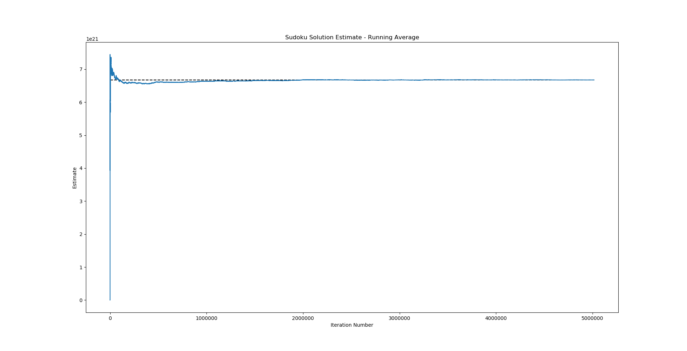

# Monte Carlo Sudoku Solution Estimator

Implementation of a Monte Carlo style algorithm that estimates the amount of valid solutions to a Sudoku of arbitrary size.

Original idea based on <a>https://theartofmachinery.com/2017/08/14/monte_carlo_counting_sudoku_grids.html</a>

<b>NOTE</b>: The "standard" convention of naming Sudoku sizes after their block size instead of total grid size is used throughout this codebase,
and in this readme as well. This means the standard size Sudoku is referred to as a 3x3 Sudoku, instead of a 9x9 Sudoku.
This is done to avoid ambiguities when dealing with non-square blocks. For example, a "16x16 Sudoku" could consists of 2x8 blocks or 4x4 blocks.

Plot of the running average of 5 million estimates of the number of 3x3 Sudoku solutions. The dotted line represents the actual number of Sudoku solutions. The average of the estimates converges quickly and gets really close to the actual number.

### Features
- Supports Sudokus of different sizes. Sudoku puzzles with non-square blocks such as 2x3 or 3x4 are supported as well.
- Multithreading using all available cores.

### About

The algorithm uses a clever trick to reduce the search space of the problem. This trick is based on the observation that in a NxM Sudoku every Nth row is part of a different block, meaning these rows are only restricting eachother with regard to the column rule. This means these M rows together form a M by N\*M Latin Rectangle.
Thus, if at the start of the algorithm we uniformly choose such a random Latin Rectangle and use it to fill in every Nth row, we have reduced the search space of the problem by the number of M x N\*M Latin Rectagles. For the standard Sudoku where N=M=3, this means we can reduce the search space by a factor of 2102110586634240, which speeds up the algorithm enormously

### Dependencies
- MPIR 3.0.0 - https://github.com/wbhart/mpir - Highly optimized math library for large numbers.

### How to build
The x64 haswell_avx ``.lib`` for MPIR is included in the repository. If you wish to build for a different platform or for a different architecture, you will need to download the MPIR library from http://www.mpir.org/downloads.html, and build a ``.lib`` for the desired platform.

The rest of the program should work out of the box using Visual Studio 2019. The project uses C++ 17 features such as ``if constexpr``.
